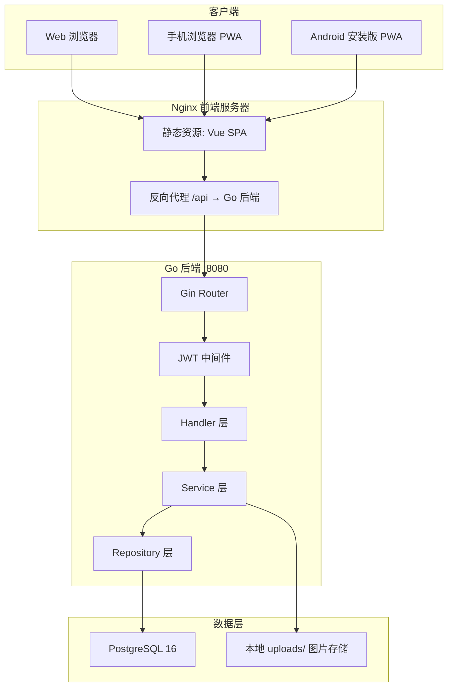
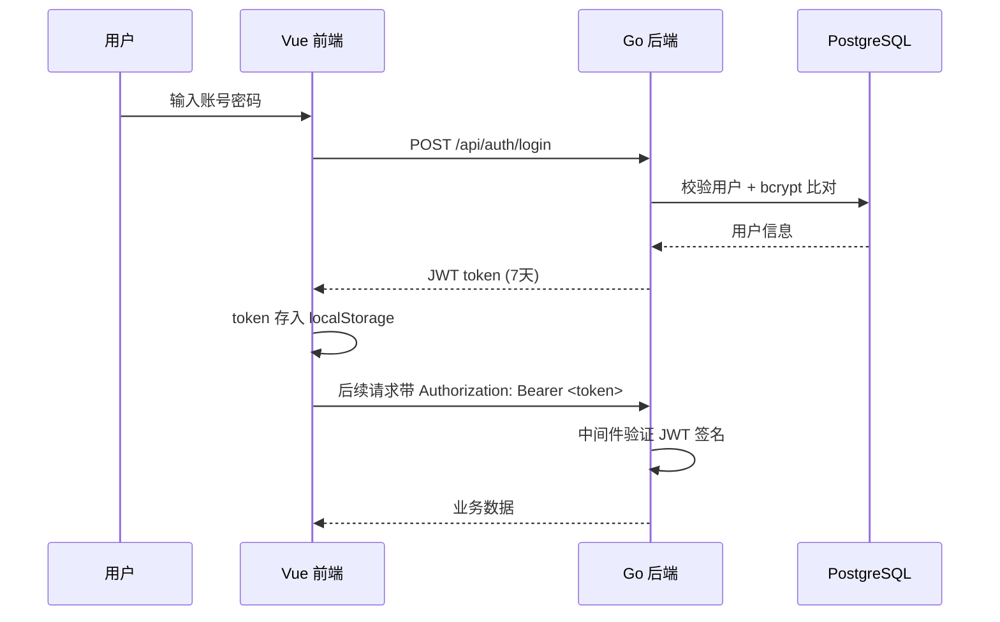
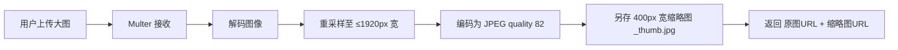
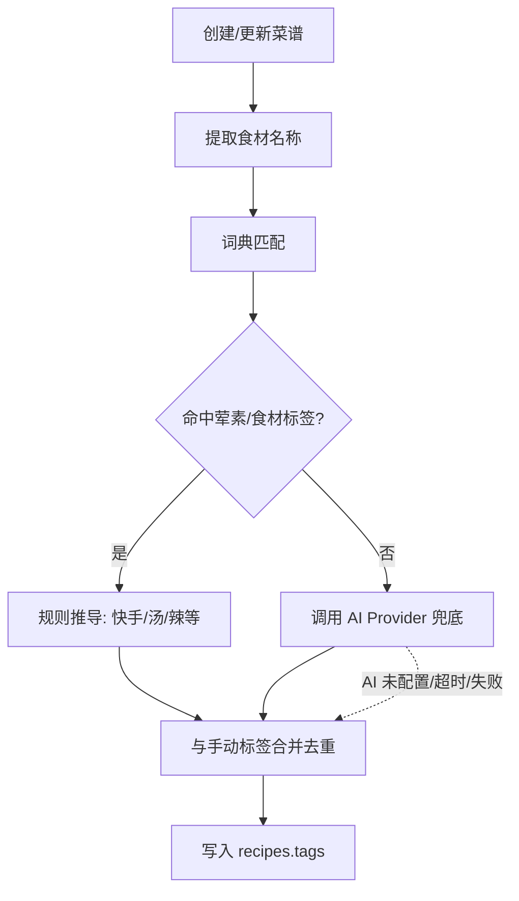
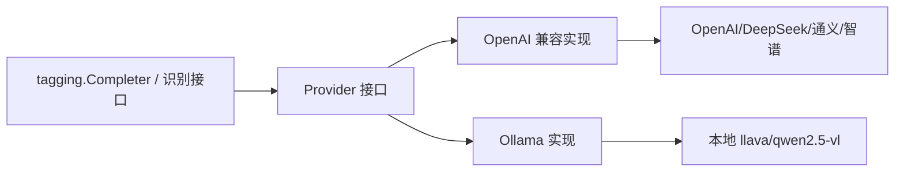
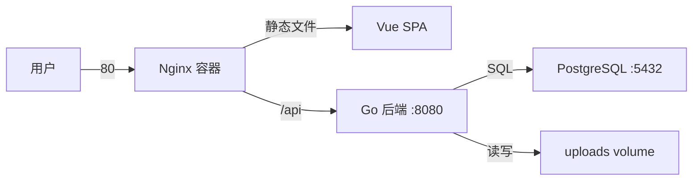

# 系统架构设计 (Architecture)

> 更新日期：2026-08-11

## 1. 系统概述

美食日志（Food Log）是一个个人美食记录应用，用于记录自制菜谱、餐厅探店和菜品点评，支持多端访问。

## 2. 架构图



## 3. 技术选型与理由

| 领域 | 选型 | 理由 |
|---|---|---|
| 前端框架 | Vue 3 + Vite | 轻量、组合式 API、构建快 |
| UI 组件库 | Element Plus | Vue 3 生态、表单/上传组件成熟、响应式适配 |
| 状态管理 | Pinia | Vue 官方推荐、TypeScript 友好 |
| PWA | vite-plugin-pwa | 自动生成 manifest + Service Worker，可安装到 Android |
| 后端 | Go + Gin | 高性能、并发强、单二进制部署方便、静态类型安全 |
| 数据库驱动 | pgx/v5 | PostgreSQL 官方推荐驱动，连接池性能好 |
| 认证 | JWT (golang-jwt) | 无状态认证，适合前后端分离 + PWA |
| 密码加密 | bcrypt | 安全的密码哈希算法 |
| 图片处理 | imaging | 纯 Go 图片缩放/格式转换，无 CGO 依赖 |
| AI 标签/识别 | OpenAI 兼容协议 + Ollama | 通用 Provider 接口（chat + vision），词典优先 + AI 兜底 |
| 数据库 | PostgreSQL 16 | 功能完善，JSONB 支持灵活的结构化数据 |
| 部署 | Docker Compose | 一键启动数据库 + 后端 + 前端 |

## 4. 分层架构

```
┌─────────────────────────────────────────────┐
│ Router 层    路由注册、中间件装配            │
├─────────────────────────────────────────────┤
│ Middleware 层  JWT 认证 / CORS / 日志 / 限流  │
├─────────────────────────────────────────────┤
│ Handler 层    解析请求、校验参数、组装响应     │
├─────────────────────────────────────────────┤
│ Service 层    业务逻辑、事务、图片处理         │
├─────────────────────────────────────────────┤
│ Repository 层  SQL 查询、数据持久化           │
├─────────────────────────────────────────────┤
│ PostgreSQL / 文件存储                        │
└─────────────────────────────────────────────┘
```

依赖方向：Router → Middleware → Handler → Service → Repository（单向依赖，易于测试和维护）。

## 5. 前端架构

```
client/src/
├── router/       # 路由配置 + 登录守卫
├── stores/       # Pinia 状态（auth / recipe / restaurant）
├── api/          # Axios 封装 + 各模块 API
├── views/        # 页面组件
├── components/   # 布局 + 业务 + 通用组件
└── utils/        # 工具函数
```

### 5.1 路由设计

| 路径 | 页面 | 需登录 |
|---|---|---|
| `/login` | 登录 | ✗ |
| `/register` | 注册 | ✗ |
| `/` | 首页 Dashboard | ✓ |
| `/recipes` | 菜谱列表 | ✓ |
| `/recipes/new` | 新建菜谱 | ✓ |
| `/recipes/:id` | 菜谱详情 | ✓ |
| `/recipes/:id/edit` | 编辑菜谱 | ✓ |
| `/restaurants` | 餐厅列表 | ✓ |
| `/restaurants/new` | 新建餐厅 | ✓ |
| `/restaurants/:id` | 餐厅详情 | ✓ |
| `/restaurants/:id/edit` | 编辑餐厅 | ✓ |
| `/restaurants/:id/dishes/new` | 添加菜品 | ✓ |
| `/profile` | 个人中心 | ✓ |

### 5.2 响应式布局

- **移动端（<768px）**：底部 TabBar（首页/菜谱/餐厅/我的）
- **桌面端（≥768px）**：侧边栏导航
- 同一套组件，通过 CSS Media Query 自适应

### 5.3 状态管理

- `useAuthStore`：token、用户信息、登录/登出
- `useRecipeStore`：菜谱列表、当前菜谱、分页状态
- `useRestaurantStore`：餐厅列表、当前餐厅、菜品列表

## 6. 认证流程



## 7. 图片处理流程



存储规则：`uploads/YYYY/MM/uuid.jpg`（原图）与 `uploads/YYYY/MM/uuid_thumb.jpg`（缩略图）。

## 7.1 自动标签与 AI 识别

### 自动标签流程



- **词典**（`internal/tagging/dictionary.go`）：食材关键词 → 标签，含荤素/食材/场景/时段/菜系/口味六类预设词表；荤素互斥（蛋归荤）
- **核心**（`internal/tagging/tagging.go`）：`Generate` 匹配 → 规则推导 → 手动合并去重；AI 兜底失败静默降级
- **词表接口** `GET /api/recipes/tags` 供前端选择器使用

### AI Provider 架构



- 通过 `AI_PROVIDER`（openai | ollama）选择实现；`AI_BASE_URL`/`AI_API_KEY`/`AI_MODEL`/`AI_TIMEOUT` 配置
- OpenAI 兼容实现：标准库 `net/http` 直连 `/chat/completions`，支持文本与 `image_url` 视觉输入
- Ollama 实现：原生 `/api/chat`，图片下载转 base64 传 `images` 字段
- 前端可通过 `X-AI-Key` 请求头覆盖 API Key；`AI_API_KEY` 为空即禁用 AI
- 图片识别：`POST /api/recipes/ai/recognize` 识别菜名/食材/标签，回填菜谱表单

## 8. 安全设计

- 密码使用 bcrypt 加盐哈希存储
- JWT 密钥通过环境变量注入，生产环境强制更换
- 所有写操作接口均需 JWT 认证，且校验资源归属（user_id）
- 图片上传校验 MIME 类型与大小，重编码防止恶意文件
- CORS 白名单配置，仅允许可信来源

## 9. 部署架构



三个容器通过 Docker Compose 编排，数据（数据库 + 图片）使用 volume 持久化。

## 10. 目录结构

```
food-log/
├── docs/                    # 开发文档
├── scripts/                 # 工具脚本
├── server/                  # Go 后端
│   ├── cmd/main.go          # 入口
│   ├── internal/
│   │   ├── config/          # 配置加载
│   │   ├── model/           # 数据模型
│   │   ├── repository/      # 数据访问
│   │   ├── service/         # 业务逻辑
│   │   ├── handler/         # HTTP 处理器
│   │   ├── middleware/      # 中间件
│   │   ├── tagging/         # 自动标签（词典 + 核心逻辑）
│   │   ├── ai/              # AI Provider（接口 + OpenAI/Ollama 实现）
│   │   └── router/          # 路由
│   ├── migrations/          # SQL 迁移
│   └── uploads/             # 上传图片
├── client/                  # Vue 前端
│   ├── public/              # 静态资源 + PWA 图标
│   └── src/
└── docker-compose.yml
```
