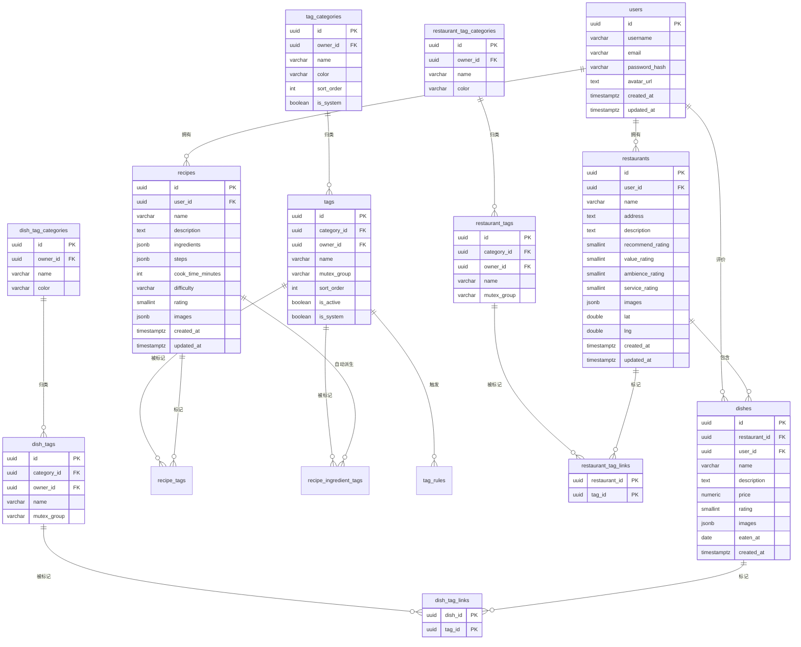

# 数据库设计 (Database)

> 更新日期：2026-10-07
> 数据库：PostgreSQL 16

## 1. ER 图



## 2. 表结构

### 2.1 users — 用户表

| 列 | 类型 | 约束 | 说明 |
|---|---|---|---|
| id | UUID | PK, DEFAULT gen_random_uuid() | 主键 |
| username | VARCHAR(50) | UNIQUE, NOT NULL | 用户名 |
| email | VARCHAR(255) | UNIQUE, NOT NULL | 邮箱 |
| password_hash | VARCHAR(255) | NOT NULL | bcrypt 哈希 |
| avatar_url | TEXT | | 头像 |
| created_at | TIMESTAMPTZ | DEFAULT now() | |
| updated_at | TIMESTAMPTZ | DEFAULT now() | |

### 2.2 recipes — 自制菜谱表

| 列 | 类型 | 约束 | 说明 |
|---|---|---|---|
| id | UUID | PK | 主键 |
| user_id | UUID | FK → users(id), NOT NULL | 所属用户 |
| name | VARCHAR(200) | NOT NULL | 菜名 |
| description | TEXT | | 描述 |
| ingredients | JSONB | | 食材 `[{name, amount, unit}]` |
| steps | JSONB | | 步骤 `[{order, content, image}]` |
| cook_time_minutes | INT | | 烹饪耗时（分钟） |
| difficulty | VARCHAR(20) | CHECK in (easy,medium,hard) | 难度 |
| rating | SMALLINT | CHECK 1-5 | 自评 |
| images | JSONB | | 图片 `["/images/recipe/xx.jpg"]` |
| created_at | TIMESTAMPTZ | | |
| updated_at | TIMESTAMPTZ | | |

> 标签不再存于 `recipes` 表，已拆分为 `tag_categories` / `tags` / `recipe_tags` / `recipe_ingredient_tags` / `tag_rules`，详见 [标签体系](./tags.md)。

### 2.3 restaurants — 餐厅表

| 列 | 类型 | 约束 | 说明 |
|---|---|---|---|
| id | UUID | PK | 主键 |
| user_id | UUID | FK → users(id), NOT NULL | 所属用户 |
| name | VARCHAR(200) | NOT NULL | 店名 |
| address | TEXT | | 地址 |
| description | TEXT | | 备注 |
| recommend_rating | SMALLINT | CHECK 1-5 | 推荐度（我的主观总评） |
| value_rating | SMALLINT | CHECK 1-5 | 性价比 |
| ambience_rating | SMALLINT | CHECK 1-5 | 环境 |
| service_rating | SMALLINT | CHECK 1-5 | 服务 |
| images | JSONB | | 环境照片 |
| lat | DOUBLE PRECISION | | 纬度 |
| lng | DOUBLE PRECISION | | 经度 |
| created_at | TIMESTAMPTZ | | |
| updated_at | TIMESTAMPTZ | | |

> 四个评分字段均为可空（NULL = 未评分），界面用 1-5 星展示。
>
> 标签不再存于 `restaurants` 表，由 `restaurant_tag_categories` / `restaurant_tags` / `restaurant_tag_links` 承载，详见 [标签体系](./tags.md)。
>
> **历史变更**（`004_shop_tags.sql`）：删除了 `cuisine_type`（改由「品类 / 菜系」标签承载）与 `avg_rating`（改由 `recommend_rating` 取代，不再由菜品评分自动重算）。

### 2.4 dishes — 店内菜品表

| 列 | 类型 | 约束 | 说明 |
|---|---|---|---|
| id | UUID | PK | 主键 |
| restaurant_id | UUID | FK → restaurants(id), NOT NULL | 所属餐厅 |
| user_id | UUID | FK → users(id), NOT NULL | 评价用户 |
| name | VARCHAR(200) | NOT NULL | 菜名 |
| description | TEXT | | 口味描述 |
| price | NUMERIC(10,2) | | 价格 |
| rating | SMALLINT | CHECK 1-5 | 推荐度（界面文案） |
| images | JSONB | | 照片 |
| eaten_at | DATE | | 就餐日期 |
| created_at | TIMESTAMPTZ | | |

> `rating` 沿用旧列名，语义即界面上展示的「推荐度」。菜品的标签由 `dish_tag_categories` / `dish_tags` / `dish_tag_links` 承载。

### 2.5 recipe_favorites — 菜谱收藏表

| 列 | 类型 | 约束 | 说明 |
|---|---|---|---|
| id | UUID | PK | 主键 |
| user_id | UUID | FK → users(id), NOT NULL | 收藏用户 |
| recipe_id | UUID | FK → recipes(id), NOT NULL | 被收藏菜谱 |
| created_at | TIMESTAMPTZ | DEFAULT now() | 收藏时间 |

- `UNIQUE(user_id, recipe_id)`：同一用户对同一菜谱只收藏一次（接口幂等）
- 索引 `idx_recipe_favorites_user (user_id, created_at DESC)` 支持收藏列表与过滤查询

### 2.6 探店标签表（餐厅 / 菜品各一套）

三张表一组，结构完全同构；每组与菜谱标签体系完全隔离，由 `004_shop_tags.sql` 建立。

| 表 | 说明 |
|---|---|
| `restaurant_tag_categories` | 餐厅标签分类（`owner_id IS NULL` = 全局预设），含 `color`、`sort_order`、`is_system` |
| `restaurant_tags` | 餐厅标签，含 `mutex_group`（同组互斥） |
| `restaurant_tag_links` | 餐厅 ↔ 标签（复合主键 `(restaurant_id, tag_id)`） |
| `dish_tag_categories` | 菜品标签分类 |
| `dish_tags` | 菜品标签 |
| `dish_tag_links` | 菜品 ↔ 标签（复合主键 `(dish_id, tag_id)`） |

约定与菜谱标签一致：

- 可见性：`owner_id IS NULL`（全局预设） ∪ `owner_id = 当前用户`（私有自定义）
- `name` 在同一 owner 下唯一：`UNIQUE NULLS NOT DISTINCT (owner_id, name)`
- `is_system = true` 的分类/标签对所有人只读
- 字典表带 `updated_at` 触发器；关联表无 `updated_at`
- 外键全部 `ON DELETE CASCADE`：删餐厅/菜品/标签/分类都会自动清理关联，无需事务内手写清理

## 3. 索引策略

```sql
-- users
CREATE UNIQUE INDEX idx_users_username ON users(username);
CREATE UNIQUE INDEX idx_users_email ON users(email);

-- recipes（按用户查询 + 按创建时间排序）
CREATE INDEX idx_recipes_user_created ON recipes(user_id, created_at DESC);
CREATE INDEX idx_recipes_name ON recipes(name);

-- 标签（菜谱关联按 tag_id 反查；互斥组用于选择器）
CREATE INDEX idx_recipe_tags_tag ON recipe_tags(tag_id);
CREATE INDEX idx_recipe_ingredient_tags_tag ON recipe_ingredient_tags(tag_id);
CREATE INDEX idx_tags_category ON tags(category_id);
CREATE INDEX idx_tags_owner ON tags(owner_id);
CREATE INDEX idx_tags_mutex ON tags(mutex_group);
CREATE INDEX idx_tag_rules_active ON tag_rules(is_active, sort_order);

-- restaurants
CREATE INDEX idx_restaurants_user_created ON restaurants(user_id, created_at DESC);

-- 探店标签
CREATE INDEX idx_restaurant_tag_categories_owner ON restaurant_tag_categories(owner_id);
CREATE INDEX idx_restaurant_tags_category ON restaurant_tags(category_id);
CREATE INDEX idx_restaurant_tags_owner ON restaurant_tags(owner_id);
CREATE INDEX idx_restaurant_tags_mutex ON restaurant_tags(mutex_group);
CREATE INDEX idx_restaurant_tag_links_tag ON restaurant_tag_links(tag_id);
CREATE INDEX idx_dish_tag_categories_owner ON dish_tag_categories(owner_id);
CREATE INDEX idx_dish_tags_category ON dish_tags(category_id);
CREATE INDEX idx_dish_tags_owner ON dish_tags(owner_id);
CREATE INDEX idx_dish_tags_mutex ON dish_tags(mutex_group);
CREATE INDEX idx_dish_tag_links_tag ON dish_tag_links(tag_id);

-- dishes（按餐厅查询 + 按就餐日期排序）
CREATE INDEX idx_dishes_restaurant ON dishes(restaurant_id, eaten_at DESC);
```

> `idx_restaurants_cuisine` 已随 `cuisine_type` 列一并删除（见 `004_shop_tags.sql`）。
> 按标签筛选实体的查询走 `EXISTS (SELECT 1 FROM <link_table> WHERE ...)`，由关联表的复合主键与 `tag_id` 索引支撑。

## 4. 关键设计说明

- **JSONB 存储结构化数据**：食材、步骤、图片使用 JSONB，避免过度建表
- **标签字典化**：标签拆到独立表，实体与标签按 id 关联。菜谱区分菜谱级（手选）与食材级（规则派生）；餐厅与菜品各自一套独立字典。预设与用户自定义共存，详见 [标签体系](./tags.md)
- **标签不存 JSONB 数组**：关联表 + 复合主键能利用外键级联与存在性索引，比 JSONB 数组更易保证一致性
- **UUID 主键**：使用 PostgreSQL 内置 `gen_random_uuid()`，避免自增主键暴露数据量
- **软删除策略**：当前采用硬删除（DELETE），后续如需可回收再引入 deleted_at
- **菜品与餐厅强关联**：菜品通过 restaurant_id 归属餐厅，级联删除保证数据一致
- **updated_at 自动更新**：通过触发器或应用层维护

## 5. 迁移文件

迁移文件内嵌在服务二进制中（`server/migrations/embed.go`），由 `server/internal/database/migrate.go` 在**服务启动时**执行，不再依赖独立脚本。

| 文件 | 内容 | 执行范围 |
|---|---|---|
| `server/migrations/001_schema.sql` | 全部表 / 索引 / 触发器（用户、菜谱、餐厅、菜品、收藏、标签分类/标签/关联/规则） | 开发 + 生产 |
| `server/migrations/002_catalog.sql` | 初始数据：全局预设分类、标签词表与自动标签规则（固定 UUID） | 开发 + 生产 |
| `server/migrations/003_demo_seed.sql` | 演示数据：`admin/admin` 账号、示例菜谱/餐厅/菜品、演示菜谱标签 | **仅开发** |

> **执行方式**：服务启动时自动执行，`schema_migrations` 表记录已执行文件名并跳过重复项；
> 每个文件在独立事务内执行，失败则回滚并终止启动。
> `APP_ENV=development` 时额外执行 `003_demo_seed.sql`；生产模式（`APP_ENV` 默认值）跳过演示数据。
> 迁移期间使用 `pg_advisory_lock` 串行化，避免多实例并发初始化。
>
> **空库初始化**：检测到不存在 `users` 表时执行全量初始化；已初始化的库只补执行新增迁移文件。
>
> **管理员引导**（仅生产模式）：库中不存在 `ADMIN_USERNAME`（默认 `admin`）时创建该账号，
> 密码取 `ADMIN_PASSWORD`；未设置则生成 UUIDv7 随机密码并写入
> `{DATA_DIR}/credentials/admin-password.txt`（权限 0600），后续启动复用该文件；
> 已存在的账号不会被覆盖。
>
> 全部迁移文件必须幂等（`IF NOT EXISTS` / `ON CONFLICT`），以便在旧库上重复执行不产生副作用。

## 6. 迁移记录

| 版本 | 日期 | 描述 |
|---|---|---|
| 001 | 2026-08-11 | 初始建表 |
| 002 | 2026-08-11 | 种子数据 |
| 003 | 2026-08-16 | 菜谱收藏表 |
| 004 | 2026-10-07 | 标签字典化：分类/标签/关联/规则表 + 预设词表种子 |
| 整合 | 2026-10-07 | 原 5 个迁移文件整合为结构 / 初始数据 / 演示数据三个文件，改由服务启动时执行 |
| 005 | 2026-10-07 | 存量标签迁移，删除 `recipes.tags` 列 |
