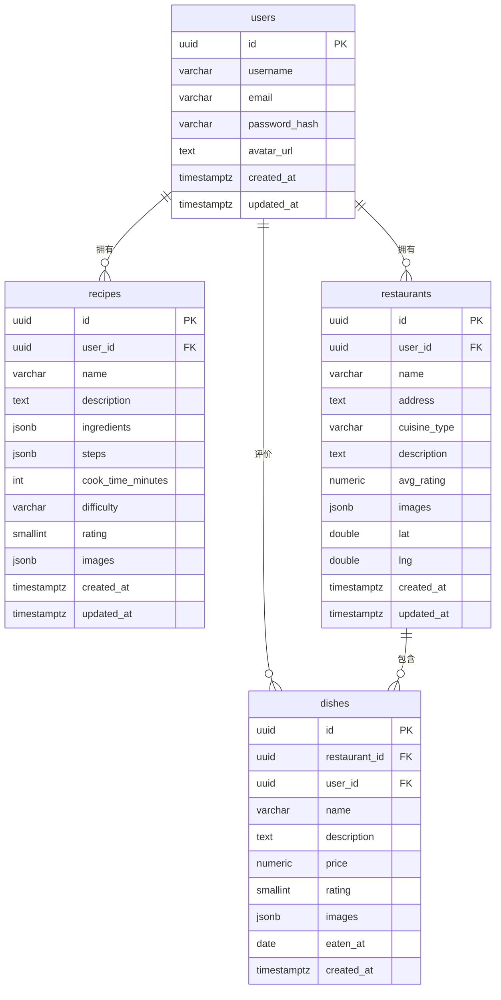

# 数据库设计 (Database)

> 更新日期：2026-08-11
> 数据库：PostgreSQL 16

## 1. ER 图



## 2. 表结构

### 2.1 users — 用户表

| 列 | 类型 | 约束 | 说明 |
|---|---|---|---|
| id | UUID | PK, DEFAULT gen_random_uuid() | 主键 |
| username | VARCHAR(50) | UNIQUE, NOT NULL | 用户名 |
| email | VARCHAR(255) | UNIQUE, NOT NULL | 邮箱 |
| password_hash | VARCHAR(255) | NOT NULL | bcrypt 哈希 |
| avatar_url | TEXT | | 头像 |
| created_at | TIMESTAMPTZ | DEFAULT now() | |
| updated_at | TIMESTAMPTZ | DEFAULT now() | |

### 2.2 recipes — 自制菜谱表

| 列 | 类型 | 约束 | 说明 |
|---|---|---|---|
| id | UUID | PK | 主键 |
| user_id | UUID | FK → users(id), NOT NULL | 所属用户 |
| name | VARCHAR(200) | NOT NULL | 菜名 |
| description | TEXT | | 描述 |
| ingredients | JSONB | | 食材 `[{name, amount, unit}]` |
| steps | JSONB | | 步骤 `[{order, content, image}]` |
| cook_time_minutes | INT | | 烹饪耗时（分钟） |
| difficulty | VARCHAR(20) | CHECK in (easy,medium,hard) | 难度 |
| rating | SMALLINT | CHECK 1-5 | 自评 |
| images | JSONB | | 图片 `["/uploads/xx.jpg"]` |
| created_at | TIMESTAMPTZ | | |
| updated_at | TIMESTAMPTZ | | |

> 标签不再存于 `recipes` 表，已拆分为 `tag_categories` / `tags` / `recipe_tags` / `recipe_ingredient_tags` / `tag_rules`，详见 [标签体系](./tags.md)。

### 2.3 restaurants — 餐厅表

| 列 | 类型 | 约束 | 说明 |
|---|---|---|---|
| id | UUID | PK | 主键 |
| user_id | UUID | FK → users(id), NOT NULL | 所属用户 |
| name | VARCHAR(200) | NOT NULL | 店名 |
| address | TEXT | | 地址 |
| cuisine_type | VARCHAR(100) | | 菜系 |
| description | TEXT | | 备注 |
| avg_rating | NUMERIC(2,1) | CHECK 0-5 | 综合评分 |
| images | JSONB | | 环境照片 |
| lat | DOUBLE PRECISION | | 纬度 |
| lng | DOUBLE PRECISION | | 经度 |
| created_at | TIMESTAMPTZ | | |
| updated_at | TIMESTAMPTZ | | |

### 2.4 dishes — 店内菜品表

| 列 | 类型 | 约束 | 说明 |
|---|---|---|---|
| id | UUID | PK | 主键 |
| restaurant_id | UUID | FK → restaurants(id), NOT NULL | 所属餐厅 |
| user_id | UUID | FK → users(id), NOT NULL | 评价用户 |
| name | VARCHAR(200) | NOT NULL | 菜名 |
| description | TEXT | | 口味描述 |
| price | NUMERIC(10,2) | | 价格 |
| rating | SMALLINT | CHECK 1-5 | 评分 |
| images | JSONB | | 照片 |
| eaten_at | DATE | | 就餐日期 |
| created_at | TIMESTAMPTZ | | |

### 2.5 recipe_favorites — 菜谱收藏表

| 列 | 类型 | 约束 | 说明 |
|---|---|---|---|
| id | UUID | PK | 主键 |
| user_id | UUID | FK → users(id), NOT NULL | 收藏用户 |
| recipe_id | UUID | FK → recipes(id), NOT NULL | 被收藏菜谱 |
| created_at | TIMESTAMPTZ | DEFAULT now() | 收藏时间 |

- `UNIQUE(user_id, recipe_id)`：同一用户对同一菜谱只收藏一次（接口幂等）
- 索引 `idx_recipe_favorites_user (user_id, created_at DESC)` 支持收藏列表与过滤查询

## 3. 索引策略

```sql
-- users
CREATE UNIQUE INDEX idx_users_username ON users(username);
CREATE UNIQUE INDEX idx_users_email ON users(email);

-- recipes（按用户查询 + 按创建时间排序）
CREATE INDEX idx_recipes_user_created ON recipes(user_id, created_at DESC);
CREATE INDEX idx_recipes_name ON recipes(name);

-- 标签（菜谱关联按 tag_id 反查；互斥组用于选择器）
CREATE INDEX idx_recipe_tags_tag ON recipe_tags(tag_id);
CREATE INDEX idx_recipe_ingredient_tags_tag ON recipe_ingredient_tags(tag_id);
CREATE INDEX idx_tags_category ON tags(category_id);
CREATE INDEX idx_tags_owner ON tags(owner_id);
CREATE INDEX idx_tags_mutex ON tags(mutex_group);
CREATE INDEX idx_tag_rules_active ON tag_rules(is_active, sort_order);

-- restaurants
CREATE INDEX idx_restaurants_user_created ON restaurants(user_id, created_at DESC);
CREATE INDEX idx_restaurants_cuisine ON restaurants(cuisine_type);

-- dishes（按餐厅查询 + 按就餐日期排序）
CREATE INDEX idx_dishes_restaurant ON dishes(restaurant_id, eaten_at DESC);
```

## 4. 关键设计说明

- **JSONB 存储结构化数据**：食材、步骤、图片使用 JSONB，避免过度建表
- **标签字典化**：标签拆到独立表，菜谱与标签按 id 关联，区分菜谱级（手选）与食材级（规则派生）；预设与用户自定义共存，详见 [标签体系](./tags.md)
- **UUID 主键**：使用 PostgreSQL 内置 `gen_random_uuid()`，避免自增主键暴露数据量
- **软删除策略**：当前采用硬删除（DELETE），后续如需可回收再引入 deleted_at
- **菜品与餐厅强关联**：菜品通过 restaurant_id 归属餐厅，级联删除保证数据一致
- **updated_at 自动更新**：通过触发器或应用层维护

## 5. 迁移文件

| 文件 | 内容 |
|---|---|
| `server/migrations/001_init.sql` | 建表 + 索引 + 触发器 |
| `server/migrations/002_seed.sql` | 测试种子数据（示例菜谱使用固定 UUID，便于标签种子引用） |
| `server/migrations/003_favorites.sql` | 菜谱收藏表 |
| `server/migrations/004_tags.sql` | 标签分类/标签/关联/规则表 + 全局预设词表与规则种子 |
| `server/migrations/005_recipe_tags_migrate.sql` | 存量 `recipes.tags` → 自定义标签并删除该列；演示菜谱标签种子 |

> **执行方式**：Docker 路径由 `scripts/migrate-docker.sh` 通过 `schema_migrations` 表记录并跳过已执行文件；
> 本地/远程路径 `scripts/migrate.sh` **每次全量重跑**所有 `.sql`，因此所有迁移文件必须幂等。
> `recipes.tags` 的建表列与 GIN 索引已从 `001` 中移除。

## 6. 迁移记录

| 版本 | 日期 | 描述 |
|---|---|---|
| 001 | 2026-08-11 | 初始建表 |
| 002 | 2026-08-11 | 种子数据 |
| 003 | 2026-08-16 | 菜谱收藏表 |
| 004 | 2026-10-07 | 标签字典化：分类/标签/关联/规则表 + 预设词表种子 |
| 005 | 2026-10-07 | 存量标签迁移，删除 `recipes.tags` 列 |
